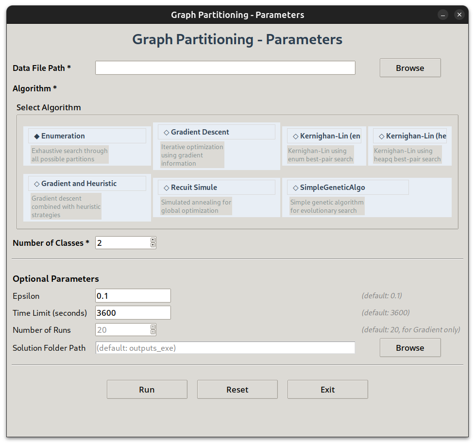
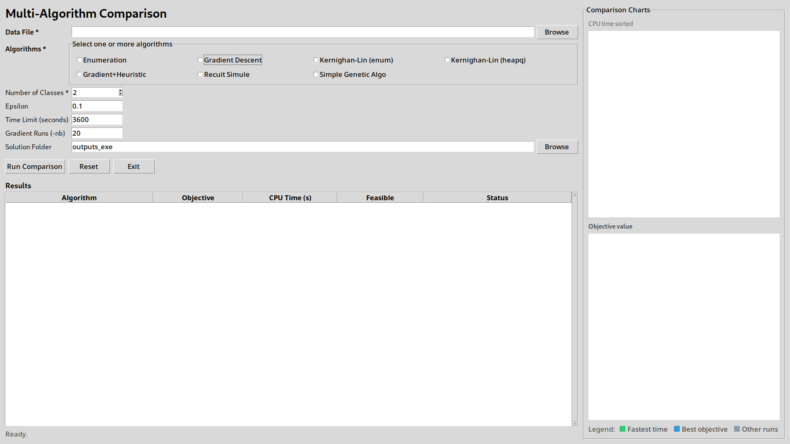

# Graph Partitioning Solver

A Python-based solver for the balanced graph partitioning problem, designed to partition weighted graphs into balanced classes while minimizing the sum of edge weights between classes (min-cut objective).

## Description

This project implements optimization algorithms to solve the graph partitioning problem.

- **Input**: A weighted undirected graph and parameter `p` (number of classes)
- **Output**: A balanced partition of graph nodes into `p` classes minimizing cut weight

### Project structure

- `src/`
  - `main.py` : entry point providing GUI/CLI launching plus ready-made examples.
  - `solver.py` : command-line that parses arguments and dispatches to algorithms.
  - `algos.py` : implementations of Enumeration, Gradient, and Kernighan-Lin solvers.
  - `data.py`, `solution.py`, `projetUtils.py` : helpers for reading instances, representing partitions, and validating feasibility.
  - `ScriptExperiments.py`, `scriptCreateSummaryFiles.py`, `SummaryFileGrad.py` : utilities to batch-run experiments and aggregate logs/results.
- `data/` : sample weighted graph instances.
- `solution/` : expected solutions for the bundled instances.
- `outputs_exe/` : default folder where CLI runs write `.sol` files if no custom path is provided.
- `resultats_csv/`: CSV summaries generated from experiments.

## Installation

### Requirements

- Python 3.10+

### Setup

```bash
# Clone the repository
git clone https://github.com/lafilledepondy/metaHeuristiques.git
cd meta

# Create virtual environment
python3 -m venv meta_env
source meta_env/bin/activate # on Linux
# meta_env\Scripts\activate # on Windows

# Install dependencies
pip install -r requirements.txt
```

## Usage

### Running the `main.py`

`main.py` now starts with a launcher question:

```text
Gui ? [yes/no]
>>>
```

- If you answer `yes`, you are prompted to choose between the single-algorithm GUI and the multi-algorithm comparison GUI.
- If you answer `no`, the solver switches to interactive terminal prompts.
- If you pass CLI flags directly, they are used without the interactive questionnaire.

#### GUI Preview

<p align="center">
  
</p>

<p align="center">
  
</p>

#### 1. Launcher + Interactive Mode (No Parameters)

Run from `src/`:

```bash
cd src
python3 main.py
```

If you choose `no` for GUI, the prompts are:

```text
dataFilePath
Algo
1.0 enum, 2.0 gradient, 3.1 KL (slow), 3.2 KL (fast), 4.0 Gradient+Heuristic, 5.0 RecuitSimule, 6.0 SimpleGeneticAlgo
nbClasses (skipped for KL)
epsilon (skipped for KL)
timeLimit (default: 3600)
nbRuns (only for gradient)
```

#### 2. Command-Line Mode (With Parameters)

```bash
cd src
python3 main.py -d <data_file> -a <algorithm> -p <num_classes> [options]
```

**Required in CLI mode:**

- `-d, --dataFilePath` - Path to the graph data file
- `-a, --algorithm` - Algorithm choice: `1.0` (Enumeration), `2.0` (Gradient Descent), `3.1` (Kernighan-Lin enum), `3.2` (Kernighan-Lin heapq)
- `-p, --nbClasses` - Required for `1.0` and `2.0`; ignored/forced to `2` for `3.1` and `3.2`

**Optional Arguments:**

- `-f, --solutionFolderPath` - Output folder for solution files (default: creates 'outputs_exe' folder if not provided)
- `-e, --epsilon` - Balance tolerance factor (default: `0.1`; forced to `0.0` for KL variants)
- `-t, --timeLimit` - Time limit in seconds (default: 3600 seconds = 1 hour)
- `-nb, --nbRuns` - Specific to Gradient solver (`-a 2.0`); default is 20 multi-start iterations.

**Notes:**

- Kernighan-Lin variants (`-a 3.1` and `-a 3.2`) support only `-p 2`.
- If `-f` is omitted, solutions are written to `outputs_exe/`.

#### Example

```bash
python3 main.py -d ../data/graph.txt -a 1.0 -p 4 -e 0.1 -t 3600
```

Or with custom output folder:

```bash
python3 main.py -d ../data/graph.txt -a 3.2 -p 2 -f ./results -e 0.0 -t 3600
```

#### Running Batch Experiments

```bash
python3 ScriptExperiments.py -d <data_folder> -f <experiment_folder> -a <algo_list> -p <class_list> -e <epsilon_list> -t <time_limit>
```

Example:

```bash
python3 ScriptExperiments.py -d ../data -f ../runs/exp -a 1.0 -p 2 4 -e 0.0 0.1 -t 120
```

#### Built-in Examples

`src/main.py` ships with quick demo helpers you can uncomment to see the algorithms in action without any CLI arguments:

- `enum_example()` runs the brute-force enumeration on `data/cinqSommets.txt`.
- `gradient_descent_example()` showcases the greedy gradient routine (set `nb_iter` to match your desired `nb_max_iter`).
- `kl_enum_example()` executes Kernighan-Lin with the enum pair-selection variant (`3.1`).
- `kl_example()` executes Kernighan-Lin with the heapq pair-selection variant (`3.2`).
- `gradient_heuristic_example()` runs the combined Gradient + Heuristic approach (`4.0`).
- `recuit_simule_example()` runs the Simulated Annealing approach (`5.0`).
- `simple_genetic_algo_example()` runs the Simple Genetic Algorithm (`6.0`).

#### Generating Result Summary

```bash
python3 scriptCreateSummaryFiles.py -l <log_folder>
```

<!-- ## Data Format

TODO

Graph files should contain:

- Header: `n m deg_min deg_max` (number of nodes, edges, min degree, max degree)
- Edges: `u v [weight]` (1-based node indices, weight optional, default 1)
- Footer: Degree information for each node -->

## Acknowledgment

Inspired by the ROAD 2026 optimization project framework by Professor Thibault PRUNET.

## License

This project is licensed under the MIT License - see the [LICENSE](LICENSE) file for details.
